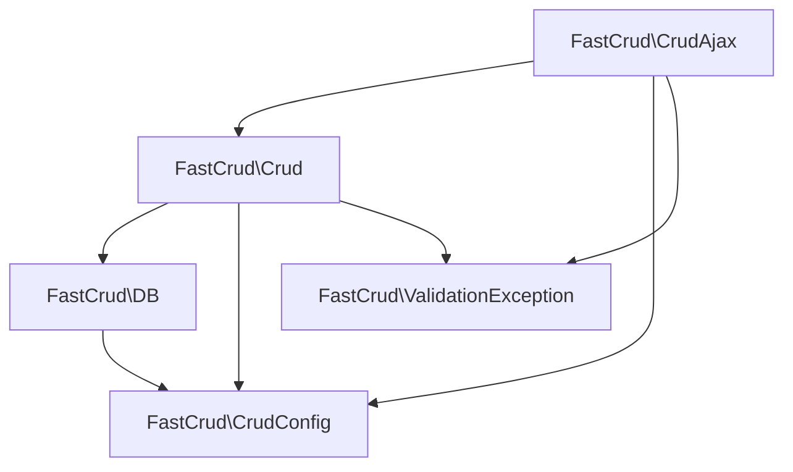

# FastCRUD - AI Agent Brief

## Project Snapshot
- Server-side PHP CRUD table builder that renders a Bootstrap 5/jQuery UI and drives it via AJAX
- Primary entry point is `FastCrud\Crud`; AJAX requests are brokered through `FastCrud\CrudAjax`
- Database connectivity is provided through `FastCrud\DB` with configuration stored on `FastCrud\CrudConfig`
- Front-end behaviours (pagination, inline edit, modals, FilePond uploads, rich editor hooks) are generated inside `Crud::generateAjaxScript()`
- PHP strict types, Bootstrap 5 utility classes, and jQuery event delegation are enforced across the project

## Architecture Overview
- **`FastCrud\Crud`** – Fluent builder for configuring table columns, field behaviours, validation, relationships, and rendering HTML/JS. Handles SQL generation, pagination, schema caching, data decoration, FilePond integration, and view/edit offcanvas markup.
- **`FastCrud\CrudAjax`** – HTTP entry point for AJAX actions (`fetch`, `read`, `update`, `delete`, `duplicate`, `upload_image`, `upload_filepond`). Normalises request payloads, instantiates `Crud` via `Crud::fromAjax()`, and serialises JSON responses.
- **`FastCrud\DB`** – Creates or stores a shared PDO instance using config from `CrudConfig`. Provides DSN builders for MySQL, PostgreSQL, and SQLite.
- **`FastCrud\CrudConfig`** – Static configuration: DB credentials, upload path, grid flags, styling defaults. Also exposes setters/getters used by `Crud` and `CrudAjax`.
- **`FastCrud\ValidationException`** – Custom exception for field validation errors returned by AJAX updates.
- **Front-end runtime** – `Crud::render()` injects Bootstrap table markup plus a self-contained jQuery script. Script bootstraps pagination, sorting, search, inline editing, duplicate/delete, FilePond widgets, TinyMCE integration, and offcanvas edit/view panels. Client state is exchanged using `data-fastcrud-config` JSON payloads.

## Codegraph


## Critical Workflows
- **Bootstrap** – Call `Crud::init($dbConfig)` early. Optional array updates `CrudConfig`, then `CrudAjax::autoHandle()` intercepts requests with `fastcrud_ajax=1`.
- **Rendering a table** – Instantiate `new Crud('table_name')`, chain configuration (columns, fields, behaviours), then call `render()`. The method emits table HTML and embeds the JS runtime with serialized config.
- **AJAX fetch cycle** – Client script calls back with `action=fetch`, primary key, pagination, search, and `config` JSON. `Crud::fromAjax()` reconstructs server-side state, applies allow-listed client overrides, runs `getTableData()`, and returns rows + metadata.
- **Record lifecycle** – `CrudAjax::handleUpdate()` decodes incoming field map, calls `Crud::updateRecord()` (validation, formatting, DB update). `deleteRecord()` and `duplicateRecord()` follow similar flows; `ValidationException` bubbles field-level errors.
- **Uploads** – `CrudAjax::handleUploadImage()` validates MIME/extension, stores the file under `CrudConfig::getUploadPath()`, and returns a public URL for TinyMCE/FilePond consumers.

## Core Rules
1. **Bootstrap 5 only** – Use Bootstrap classes, no custom CSS
2. **jQuery required** – Never use vanilla JavaScript
3. **AJAX pattern** – Follow existing AJAX request format with table ID
4. **Security** – Always escape HTML output, use PDO prepared statements
5. **Backward compatibility** – Don't break existing API
6. **PHP strict types** – Always use `declare(strict_types=1);`
7. **Namespace** – All classes in `FastCrud` namespace

## File Structure
- `src/Crud.php` – Main table builder/rendering engine (HTML, JS, SQL, schema helpers)
- `src/CrudAjax.php` – AJAX controller for CRUD + uploads
- `src/CrudConfig.php` – Global configuration flags and DB credentials
- `src/DB.php` – PDO connection factory and DSN builders
- `src/ValidationException.php` – Error container for per-field validation
- `examples/basic.php` – End-to-end demo wiring Bootstrap/jQuery assets
- `public/uploads` – Default upload destination (configurable)
- `uitest/` – Playwright configuration and tests (UI automation harness)

## Configuration APIs (selected)
- **Data shaping** – `columns()`, `limit()/limit_list()`, `order_by()`, `where()/or_where()`, `join()`, `relation()`, `subselect()`
- **Presentation** – `column_label*`, `column_pattern()`, `column_callback()`, `custom_column()`, `column_class()`, `column_width()`, `column_cut()`, `table_title()/hide_table_title()/tooltip()/icon()`, `link_button()`
- **Field layout** – `fields()`, `default_tab()`, `change_type()`, `inline_edit()`, `setPanelWidth()`
- **Field lifecycle & validation** – `pass_var()`, `pass_default()`, `readonly()`, `disabled()`, `validation_required()`, `validation_pattern()`, `unique()`
- **Meta & summaries** – `column_summary()` for SUM/AVG/MIN/MAX/COUNT footers, automatic `buildSummaries()` on fetch.
- **Direct data ops** – `getTableData()`, `getRecord()`, `updateRecord()`, `deleteRecord()`, `duplicateRecord()`

## AJAX Request Pattern
```javascript
$.ajax({
    url: window.location.pathname,
    data: {
        fastcrud_ajax: '1',
        action: 'fetch',
        table: tableName,
        id: tableId,
        // other params
    },
    success: function(response) {
        // Handle response
    }
});
```

## Adding New Features
- Analyse existing method/category before implementing.
- Introduce new AJAX endpoints inside `CrudAjax::handle()` switch.
- Extend `FastCrud\Crud` with server-side helpers for new behaviour.
- Update the generated JS (within `generateAjaxScript()`) so client actions stay in sync.
- Use Bootstrap components for UI additions; wire handlers via delegated jQuery events.
- Test changes with `examples/basic.php` or automated UI tests under `uitest/`.

## New Field Types
- `change_type('image'|'images')` uses FilePond with image preview.
- `change_type('file')` uses FilePond for a single generic file upload.
- `change_type('files')` uses FilePond for multi-file uploads (no image preview), storing a comma-separated list of saved filenames in the DB. Restrict types via `['accept' => 'application/pdf,.docx']`.
  - Saved filenames are mirrored into hidden inputs so DB writes happen via form submit.
  - Server action `upload_filepond` supports both images and generic files; images are validated against expected extensions, generic files block executable/script types.
- `change_type('json')` renders a textarea optimized for JSON with live validation and optional pretty-print. Parameters: `['rows' => 6, 'pretty' => true]`.

## HTML Escaping Pattern
```php
$safe = $this->escapeHtml($userInput);
$html = "<td>{$safe}</td>";
```

## jQuery Event Pattern
```javascript
$(document).on('click', '.my-button', function() {
    // Handler code
});
```

## Error Handling Pattern
```php
try {
    // Database operation
} catch (PDOException $exception) {
    throw new RuntimeException('Message', 0, $exception);
}
```

## Database Pattern
```php
$crud = new Crud('table_name');          // Auto-connect via CrudConfig
// OR
$crud = new Crud('table_name', $pdo);    // Use custom PDO instance
```

## Dependencies
- PHP 7.4+ with PDO extension
- Composer autoloader (`psr-4` -> `FastCrud\`)
- jQuery 3.7.1+
- Bootstrap 5.3.3 CSS + JS bundle

## Table Requirements
- Table and column identifiers must be alphanumeric with optional underscores
- Designed for MySQL, PostgreSQL, and SQLite drivers
- Primary key column strongly recommended (defaults to `id`)

## Installation
```bash
composer require mzgs/fastcrud
```

```php
require 'vendor/autoload.php';
use FastCrud\Crud;

Crud::init([
    'database' => 'mydb',
    'username' => 'user',
    'password' => 'pass',
]);
```
